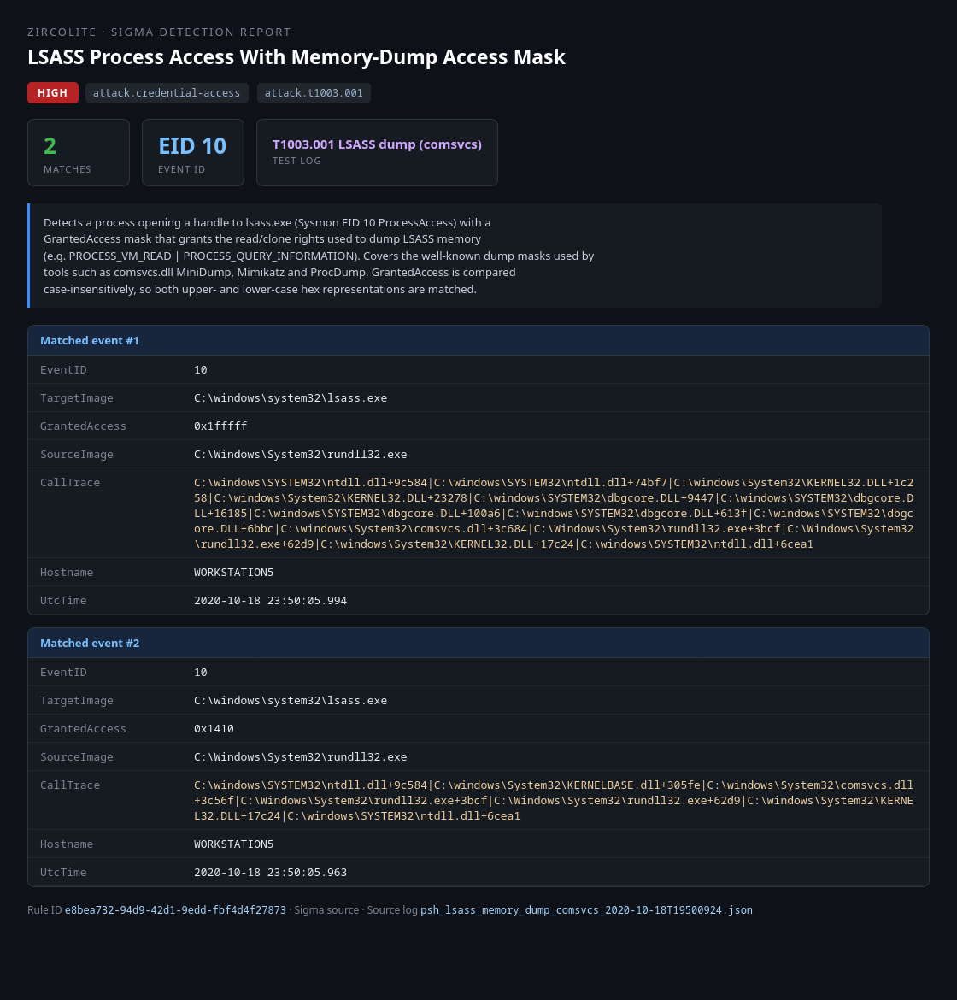
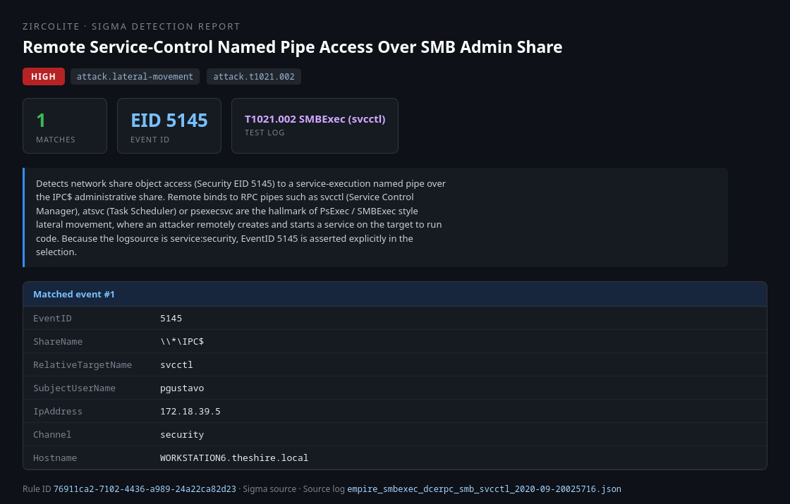
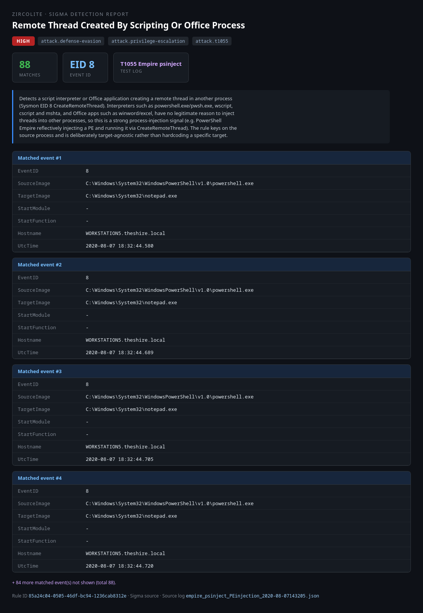
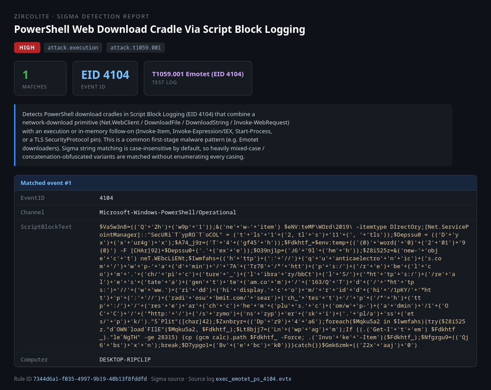
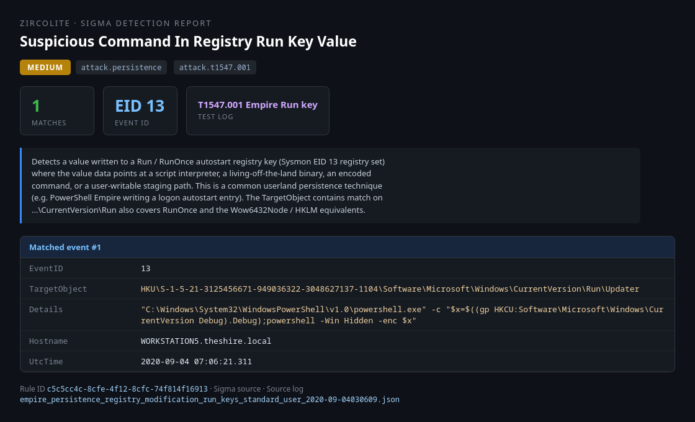

# Detection Engineering: Sigma Rules

A defensive-security portfolio project: writing [Sigma](https://sigmahq.io/)
detection rules for a set of MITRE ATT&CK techniques and testing each one
against genuine public sample attack logs (Windows + Sysmon). This is detection
engineering only - reading attacker telemetry and writing detections for it.
There is no offensive tooling and no live attacks in this repository.

The work is deliberately end-to-end and honest about its results: every rule is
run against every sample log in a full cross-matrix, true positives are
reconciled against the raw logs, and the one rule that produced false positives
was tuned and the tuning documented rather than hidden.

## Methodology

A six-step process, now complete:

1. **Pick techniques** - 5 MITRE ATT&CK techniques spanning 5 tactics (table below).
2. **Gather logs** - one real, public sample capture per technique, content-verified.
3. **Write rules** - one Sigma detection rule per technique.
4. **Test** - run all 5 rules against all 5 logs (a 5x5 matrix) with Zircolite.
5. **Tune** - remove false positives while preserving true positives.
6. **Publish** - this repository.

## Techniques and rules

| Technique | ID | Tactic | What the rule detects | Rule |
|-----------|----|--------|-----------------------|------|
| Command and Scripting Interpreter: PowerShell | T1059.001 | Execution | A PowerShell download cradle in Script Block Logging (EID 4104): a network-download primitive (`Net.WebClient` / `DownloadFile` / `Invoke-WebRequest`) combined with an execution or in-memory follow-on. | [`t1059_001_powershell_download_cradle.yml`](rules/t1059_001_powershell_download_cradle.yml) |
| OS Credential Dumping: LSASS Memory | T1003.001 | Credential Access | A process opening a handle to `lsass.exe` (Sysmon EID 10 ProcessAccess) with a `GrantedAccess` mask used to dump LSASS memory (e.g. `0x1FFFFF`, `0x1410`). | [`t1003_001_lsass_process_access_dump.yml`](rules/t1003_001_lsass_process_access_dump.yml) |
| Boot or Logon Autostart Execution: Registry Run Keys | T1547.001 | Persistence | A value written to a `Run` / `RunOnce` autostart key (Sysmon EID 13) whose data points at an interpreter, a LOLBin, an encoded command, or a user-writable staging path. | [`t1547_001_registry_run_key_suspicious_payload.yml`](rules/t1547_001_registry_run_key_suspicious_payload.yml) |
| Process Injection | T1055 | Defense Evasion / Privilege Escalation | A script interpreter or Office application creating a remote thread in another process (Sysmon EID 8 CreateRemoteThread) - target-agnostic, keyed on the source process. | [`t1055_create_remote_thread_from_scripting_process.yml`](rules/t1055_create_remote_thread_from_scripting_process.yml) |
| Remote Services: SMB/Windows Admin Shares | T1021.002 | Lateral Movement | Access to a service-execution named pipe (`svcctl` / `atsvc` / `psexecsvc`) over the `IPC$` admin share (Security EID 5145) - the PsExec / SMBExec pattern. | [`t1021_002_smb_admin_share_service_pipe.yml`](rules/t1021_002_smb_admin_share_service_pipe.yml) |

Each technique folder under `logs/` has a `SOURCE.md` documenting the exact
upstream dataset, its license, and a content verification of the events the rule
keys on.

## Testing methodology

Every rule is run against every log - a **5x5 cross-matrix, 25 cells**. The
matrix is the point of the exercise:

- The **diagonal** (a rule against its own intended log) proves the rule fires
  on the behaviour it targets - a **true positive**.
- The **off-diagonal** (a rule against the other four logs) surfaces anything
  the rule fires on that it should not - a **false-positive** check.

### Tool

**[Zircolite](https://github.com/wagga40/Zircolite) v3.7.6** runs the native
Sigma YAML directly (via pySigma + the pySigma SQLite backend), so the exact
rule files in `rules/` are what execute - no manual re-compilation. It reads the
Emotet `.evtx` with its bundled Rust parser and the OTRF JSON-lines captures
with `-j`.

Each rule is converted with **only the pySigma pipeline that matches its
logsource** (`sysmon` for the Sysmon-based rules, `windows-audit` for the
Security-log SMB rule, `windows-logsources` for the PowerShell rule). This is
deliberate: the `sysmon` and `windows-audit` pipelines both claim the generic
`registry_set` category, and stacking them produces a self-contradictory
`EventID=4657 AND EventID=13` predicate that can never match. Selecting the
correct pipeline per rule avoids that. Full detail in
[`results/README.md`](results/README.md); provisioning is pinned to tag
`v3.7.6` by [`tools/setup_zircolite.sh`](tools/setup_zircolite.sh) for
reproducibility.

### Final results (post-tuning)

Rows = rules, columns = logs. `*` marks the diagonal (the intended true
positive). Every match count was independently reconciled against the raw log
with `jq` / Python; see [`results/TEST_RESULTS.md`](results/TEST_RESULTS.md).

| rule \\ log                        | T1003 lsass | T1021 smb | T1055 inject | T1547 runkey | T1059 ps |
|------------------------------------|:-----------:|:---------:|:------------:|:------------:|:--------:|
| **t1003** lsass proc-access dump   |   **2** \*  |     0     |      0       |      0       |    0     |
| **t1021** smb admin-share pipe     |      0      |  **1** \* |      0       |      0       |    0     |
| **t1055** create remote thread     |      0      |     0     |   **88** \*  |      0       |    0     |
| **t1547** registry run key         |      0      |     0     |      0       |   **1** \*   |    0     |
| **t1059** ps download cradle       |      0      |     1     |      1       |      1       | **1** \* |

All five diagonals fire and reconcile exactly against ground truth. The three
non-zero off-diagonal cells are on the **t1059** row (`t1059` fired on the
T1021, T1055 and T1547 logs). These are **not false positives**: each of those
three OTRF captures is a full PowerShell Empire attack that genuinely contains
an obfuscated PowerShell download cradle in its Script Block Logging, so a
T1059.001 cradle rule *should* fire on them. They illustrate that a multi-stage
attack legitimately trips multiple detections at once. Every remaining cell is
`0`.

## Tuning story: the LSASS rule

Step 5 tuned exactly one rule - the T1003.001 LSASS process-access rule - which
in the pre-tuning matrix fired on two logs it should not have:

- On the **T1021 (SMB)** capture: `CollectGuestLogs.exe`, the **Azure guest
  agent**, opening `lsass.exe` with `0x1410`. Benign monitoring - a classic FP.
- On the **T1547 (Run keys)** capture: `wininit.exe` and `csrss.exe`, **Windows
  internals**, opening `lsass.exe` with `0x1FFFFF`. Expected OS behaviour.

That is 3 false-positive matches across 2 logs. The fix added SigmaHQ-style
`filter_main_*` exclusions combined with
`condition: selection and not 1 of filter_main_*`, filtering the Azure agent by
its `\CollectGuestLogs.exe` basename and the Windows-internals processes anchored
to their `System32` paths.

The key engineering decision was **to key the filter on `SourceImage`, never on
`GrantedAccess`**. The false-positive access masks *overlap the true-positive
masks* - the malicious `rundll32.exe` dump uses the very same `0x1FFFFF` and
`0x1410` values that the Azure agent and the Windows-internals processes use.
Filtering on the mask would have killed the true positive along with the noise.
`SourceImage` is the only field that discriminates benign from malicious here.

The `wininit.exe` / `csrss.exe` filters are anchored to `:\Windows\System32\...`
rather than bare basenames, so a payload masquerading as `csrss.exe` from another
directory is still detected. Result: **3 false positives removed, true positive
preserved (2/2)**. Only the rule's YAML was edited; the full before/after grid
and reconciliation are in [`results/TEST_RESULTS.md`](results/TEST_RESULTS.md).

## Screenshots

Each screenshot is a self-contained HTML detection report (rendered by
[`results/gen_report.py`](results/gen_report.py) from Zircolite's genuine JSON
output) showing a rule firing on its intended sample log.


*T1003.001 - the LSASS rule matching `rundll32.exe` opening `lsass.exe` with dump-style access masks (2 events).*


*T1021.002 - the SMB rule matching the remote `svcctl` named-pipe bind over `IPC$` (1 event).*


*T1055 - the process-injection rule matching `powershell.exe` creating remote threads in `notepad.exe` (88 events).*


*T1059.001 - the PowerShell rule matching the obfuscated Emotet download cradle in Script Block Logging EID 4104 (1 event).*


*T1547.001 - the Run-key rule matching a `...\CurrentVersion\Run\Updater` value pointing at `powershell.exe` (1 event).*

## Setup and reproduction

For a fresh clone, in order:

```bash
# 1. Create the Python venv and install the validation/runtime deps.
python3 -m venv .venv
.venv/bin/pip install -r requirements.txt
source .venv/bin/activate

# 2. Fetch the sample logs that are not committed.
#    Four logs are downloaded on demand (three large MIT logs + one GPL log);
#    the small T1003.001 log ships vendored in the repo. See logs/ATTRIBUTION.md.
bash logs/T1059.001_powershell/fetch_sample.sh
bash logs/T1021.002_smb_admin_shares/fetch_sample.sh
bash logs/T1055_process_injection/fetch_sample.sh
bash logs/T1547.001_registry_run_keys/fetch_sample.sh

# 3. Provision the pinned Zircolite engine (clones into tools/zircolite/ at v3.7.6).
bash tools/setup_zircolite.sh

# 4. Run the full 5x5 test matrix -> results/raw/<rule>__<log>.json
bash results/run_matrix.sh
```

Each `fetch_sample.sh` verifies its download against a pinned sha256, so the
logs used locally are byte-identical to those the committed results and
screenshots were generated from.

## Layout

```
rules/        The 5 Sigma detection rules (one per technique).
logs/         Sample attack logs, one subfolder per technique, each with a
              SOURCE.md and (where applicable) a fetch_sample.sh.
              + ATTRIBUTION.md: per-dataset sources and licenses.
results/      run_matrix.sh (the 5x5 harness), gen_report.py (HTML reports),
              raw/ (per-cell Zircolite output), TEST_RESULTS.md, README.md.
screenshots/  The 5 rendered detection reports (PNG + source HTML).
tools/        setup_zircolite.sh: provisions the pinned Zircolite engine.
```

## Attribution and licensing

- **This project's own content** - the Sigma rules, scripts, and documentation
  authored by Carlos Rodas - is **MIT-licensed** (see [`LICENSE`](LICENSE)).
- **MITRE ATT&CK** technique names, IDs, and tactic mappings referenced here are
  (c) The MITRE Corporation and are used under **CC BY-SA 4.0**.
- **The sample logs under `logs/`** are third-party datasets redistributed from
  upstream projects and retain their own licenses - they are **not** covered by
  this repo's MIT license. Handling is per-file: the one small permissive log is
  vendored, the three large permissive logs are fetched on demand for repo-size
  reasons, and the one copyleft log is fetched on demand for license reasons.
  Full per-dataset sources and licenses (OTRF/Security-Datasets, MIT;
  sbousseaden/EVTX-ATTACK-SAMPLES, GPL-3.0) are in
  [`logs/ATTRIBUTION.md`](logs/ATTRIBUTION.md).
